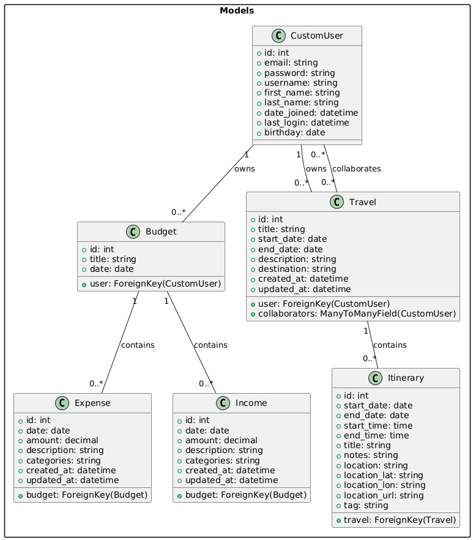

# Design and Implementation Documentation

- Group : B3
- Group members:
  - Lee Chun Yin (1155192574)
  - Fung Pak Hei (1155193590)
  - Chow Sui Ki (1155193739)

---

## 1. Introduction and Overview

The project is a Multi-purpose Planner designed to help users create, manage, and collaborate on travel plans and budget plans. The system allows users to:

- Authenticate and authorize users securely.
- Create travel plansTravel Plans with detailed itineraries.
- Invite collaborators to contribute to travel plans.
- View daily itineraries and manage travel details.
- Create Budget Plan with income/expense records.

The system is built using a Django REST Framework (DRF) backend and a React.js frontend. It leverages RESTful APIs for communication between the frontend and backend.

---

## 2. System Architecture

The system follows a client-server architecture:

### 2.1. Client-side (Frontend)

- React.js
- Provides an interactive user interface for managing travel plans and itineraries.

#### 2.1.1. Key Frontend Modules

- Login
- SignUp
- ForgotPassword
- PasswordReset
- Dashboard
- TravelPlannerHome
- TravelPlanner
- BudgetPlannerHome
- BudgetPlanner
- ItineraryCard
- LocationSearch

### 2.2. Server-side (Backend)

- Django
- Django REST Framework
- Handles business logic, data persistence, and API endpoints.
- Database: Django REST Framework built-in models is used for data storage during development.
- Deployment: Docker is used for containerization, ensuring consistent environments for development and deployment.

#### 2.2.1. Key Backend Modules

- Users System
  - `CustomUser`
  - `RegisterViewSet`
  - `LoginViewSet`
  - `UserInfoViewSet`
  - `UserSerializer`

- Travel Planner
  - `Travel`
  - `Itinerary`
  - `TravelViewSet`
  - `ItineraryViewSet`
  - `TravelSerializer`
  - `ItinerarySerializer`

- Budget Planner
  - `Budget`
  - `Expense`
  - `Income`
  - `BudgetViewSet`
  - `ExpenseViewSet`
  - `IncomeViewSet`
  - `BudgetSerializer`
  - `ExpenseSerialize`
  - `IncomeSerializer`

---

## 3. Data Design

### 3.1. Database Models

#### 3.1.1. CustomUser

- Fields:
  - `id`: Unique identifier for the user.
  - `email`: Email address of the user.
  - `password`: Encrypted password for the user.
  - `username`: Username of the user.
  - `first_name`: First name of the user.
  - `last_name`: Last name of the user.
  - `date_joined`: Date when the user joined the system.
  - `last_login`: Timestamp of the user's last login.
  - `birthday`: Birthday of the user.

- Relationships:
  - `CustomUser` is related to the `Travel` and `Budget` models:
    - Travel: A `CustomUser` can own multiple travel plans (`ForeignKey` relationship) and can collaborate on multiple travel plans (`ManyToManyField` relationship).
    - Budget: A `CustomUser` can own multiple budget plans (`ForeignKey` relationship).

#### 3.1.2. Travel

- Fields:
  - `id`: Unique identifier for the travel plan.
  - `title`: Title of the travel plan.
  - `start_date`: Start date of the travel plan.
  - `end_date`: End date of the travel plan.
  - `description`: Description of the travel plan.
  - `destination`: Destination of the travel plan.
  - `user`: Reference to the owner of the travel plan.
  - `collaborators`: List of users collaborating on the travel plan.

- Relationships:
  - `user`: ForeignKey to `CustomUser` (owner of the travel plan).
  - `collaborators`: ManyToManyField to `CustomUser`.

#### 3.1.3. Itinerary

- Fields:
  - `id`: Unique identifier for the itinerary.
  - `travel`: Reference to the associated travel plan.
  - `start_date`: Start date of the itinerary.
  - `end_date`: End date of the itinerary.
  - `start_time`: Start time of the itinerary.
  - `end_time`: End time of the itinerary.
  - `title`: Title of the itinerary.
  - `notes`: Notes for the itinerary.
  - `location`: Location of the itinerary.
  - `location_lat`: Latitude of the location.
  - `location_lon`: Longitude of the location.
  - `location_url`: URL of the location.
  - `tag`: Tag for the itinerary (e.g., "visit", "food").

- Relationships:
  - `travel`: ForeignKey to `Travel`.

#### 3.1.4. Expense

- Fields:
  - `id` (integer, auto-generated): Unique identifier for the expense.
  - `budget` (ForeignKey): Reference to the associated `Budget`.
  - `date` (DateField, optional): Date of the expense.
  - `amount` (DecimalField): Amount of the expense (max 10 digits, 2 decimal places).
  - `description` (TextField, optional): Description of the expense.
  - `categories` (CharField, optional): Category of the expense (e.g., "Food", "Transport").
  - `created_at` (DateTimeField): Timestamp when the expense was created.
  - `updated_at` (DateTimeField): Timestamp when the expense was last updated.

- Relationships:
  - `budget`: ForeignKey to `Budget`.

#### 3.1.5. Income

- Fields:
  - `id` (integer, auto-generated): Unique identifier for the income.
  - `budget` (ForeignKey): Reference to the associated `Budget`.
  - `date` (DateField, optional): Date of the income.
  - `amount` (DecimalField): Amount of the income (max 10 digits, 2 decimal places).
  - `description` (TextField, optional): Description of the income.
  - `categories` (CharField, optional): Category of the income (e.g., "Salary", "Investment").
  - `created_at` (DateTimeField): Timestamp when the income was created.
  - `updated_at` (DateTimeField): Timestamp when the income was last updated.

- Relationships:
  - `budget`: ForeignKey to `Budget`.

---

## 4. Interface Design

### 4.1. Internal API Endpoints

#### 4.1.1. Travel Endpoints

- Common Header:
  - `token`: User authentication token

- `GET /api/travel/`: List all travels for the authenticated user.
  - Parameters: None.
- `POST /api/travel/`: Create a new travel plan for the current user.
  - Parameters (JSON Body):
    - `title` (string, required): Title of the travel plan.
    - `start_date` (string, optional): Start date of the travel plan (YYYY-MM-DD).
    - `end_date` (string, optional): End date of the travel plan (YYYY-MM-DD).
    - `description` (string, optional): Description of the travel plan.
    - `destination` (string, optional): Destination of the travel plan.
- `GET /api/travel/<id>/`: Retrieve details of a specific travel plan.
  - Parameters:
    - `id` (integer, required): ID of the travel plan.
- `PATCH /api/travel/<id>/`: Update a travel plan.
  - Parameters (JSON Body):
    - `title` (string, optional): Updated title of the travel plan.
    - `start_date` (string, optional): Updated start date (YYYY-MM-DD).
    - `end_date` (string, optional): Updated end date (YYYY-MM-DD).
    - `description` (string, optional): Updated description.
    - `destination` (string, optional): Updated destination.
- `DELETE /api/travel/<id>/`: Delete a travel plan.
  - Parameters:
    - `id` (integer, required): ID of the travel plan.
- `POST /api/travel/<id>/invite_collaborator/`: Invite a collaborator to a travel plan.
  - Parameters (JSON Body):
    - `email` (string, required): Email of the user to invite.

#### 4.1.2. Itinerary Endpoints

- Common Header:
  - `token`: User authentication token

- `GET /api/travel/<travel_id>/itineraries/`: List itineraries for a specific travel plan.
  - Parameters:
    - `travel_id` (integer, required): ID of the travel plan.

- `POST /api/travel/<travel_id>/itineraries/`: Create a new itinerary.
  - Parameters (JSON Body):
    - `title` (string, required): Title of the itinerary.
    - `start_date` (string, required): Start date of the itinerary (YYYY-MM-DD).
    - `end_date` (string, required): End date of the itinerary (YYYY-MM-DD).
    - `start_time` (string, optional): Start time of the itinerary (HH:MM:SS).
    - `end_time` (string, optional): End time of the itinerary (HH:MM:SS).
    - `location` (string, optional): Location of the itinerary.
    - `location_lat` (string, optional): Latitude of the location.
    - `location_lon` (string, optional): Longitude of the location.
    - `location_url` (string, optional): URL of the location.
    - `notes` (string, optional): Notes for the itinerary.
    - `tag` (string, optional): Tag for the itinerary (e.g., "visit", "food").

- `PATCH /api/travel/<travel_id>/itineraries/<id>/`: Update an itinerary.
  - Parameters (JSON Body):
    - `id` (integer, required): ID of the itinerary.
    - `title` (string, optional): Updated title of the itinerary.
    - `start_date` (string, optional): Updated start date (YYYY-MM-DD).
    - `end_date` (string, optional): Updated end date (YYYY-MM-DD).
    - `start_time` (string, optional): Updated start time (HH:MM:SS).
    - `end_time` (string, optional): Updated end time (HH:MM:SS).
    - `location` (string, optional): Updated location.
    - `location_lat` (string, optional): Updated latitude of the location.
    - `location_lon` (string, optional): Updated longitude of the location.
    - `location_url` (string, optional): Updated URL of the location.
    - `notes` (string, optional): Updated notes for the itinerary.
    - `tag` (string, optional): Updated tag for the itinerary.

- `DELETE /api/travel/<travel_id>/itineraries/<id>/`: Delete an itinerary.
  - Parameters:
    - `travel_id` (integer, required): ID of the travel plan.
    - `id` (integer, required): ID of the itinerary.

#### 4.1.3. User Information Endpoints (Require Authentication Token)

- Common Header:
  - `token`: User authentication token

- `GET /api/userinfo/`: Retrieve details of the authenticated user.
  - Parameters: None.

- `PATCH /api/userinfo/<id>/`: Update user profile information.
  - Parameters (JSON Body):
    - `username` (string, optional): Updated username.
    - `first_name` (string, optional): Updated first name.
    - `last_name` (string, optional): Updated last name.
    - `birthday` (string, optional): Updated birthday (YYYY-MM-DD).

- `DELETE /api/userinfo/<id>/`: Delete the user account.
  - Parameters:
    - `id` (integer, required): ID of the user.

#### 4.1.4. Password Reset Endpoints

- `POST /api/password_reset/`: Request a password reset email.
  - Parameters (JSON Body):
    - `email` (string, required): Email of the user requesting the reset.

- `POST /api/password_reset/confirm/`: Reset the password using a token.
  - Parameters (JSON Body):
    - `password` (string, required): New password.
    - `token` (string, required): Password reset token.

#### 4.1.5. Sign Up Endpoint

- `POST /api/signup/`: Sign up new user.  
  - Parameters (JSON Body):
    - `email` (string, required): New email.
    - `password` (string, required): New password.

#### 4.1.6. Login Endpoint

- `POST /api/login/`: Log in an existing user.
  - Parameters (JSON Body):
    - `email` (string, required): User's email.
    - `password` (string, required): User's password.

#### 4.1.7. Budget Endpoints

- Common Header:
  - `token`: User authentication token

- `GET /api/budget/`: List all budget plans for the authenticated user.
  - Parameters: None.

- `POST /api/budget/`: Create a new budget plan for the current user.
  - Parameters (JSON Body):
    - `title` (string, optional): Title of the budget plan.

- `GET /api/budget/<id>/`: Retrieve details of a specific budget plan.
  - Parameters:
    - `id` (integer, required): ID of the budget plan.

- `PATCH /api/budget/<id>/`: Update a budget plan.
  - Parameters (JSON Body):
    - `title` (string, optional): Updated title of the budget plan.

- `DELETE /api/budget/<id>/`: Delete a budget plan.
  - Parameters:
    - `id` (integer, required): ID of the budget plan.

#### 4.1.8. Expense Endpoints

- Common Header:
  - `token`: User authentication token

- `GET /api/budget/<budget_id>/expenses/`: List all expenses for a specific budget plan.
  - Parameters:
    - `budget_id` (integer, required): ID of the budget plan.

- `POST /api/budget/<budget_id>/expenses/`: Create a new expense for a specific budget plan.
  - Parameters (JSON Body):
    - `date` (string, optional): Date of the expense (YYYY-MM-DD).
    - `amount` (decimal, required): Amount of the expense.
    - `description` (string, optional): Description of the expense.
    - `categories` (string, optional): Category of the expense (e.g., "food", "transport").

- `PATCH /api/budget/<budget_id>/expenses/<id>/`: Update an expense.
  - Parameters (JSON Body):
    - `date` (string, optional): Updated date of the expense (YYYY-MM-DD).
    - `amount` (decimal, optional): Updated amount of the expense.
    - `description` (string, optional): Updated description of the expense.
    - `categories` (string, optional): Updated category of the expense.

- `DELETE /api/budget/<budget_id>/expenses/<id>/`: Delete an expense.
  - Parameters:
    - `budget_id` (integer, required): ID of the budget plan.
    - `id` (integer, required): ID of the expense.

#### 4.1.9. Income Endpoints

- Common Header:
  - `token`: User authentication token

- `GET /api/budget/<budget_id>/incomes/`: List all incomes for a specific budget plan.
  - Parameters:
    - `budget_id` (integer, required): ID of the budget plan.

- `POST /api/budget/<budget_id>/incomes/`: Create a new income for a specific budget plan.
  - Parameters (JSON Body):
    - `date` (string, optional): Date of the income (YYYY-MM-DD).
    - `amount` (decimal, required): Amount of the income.
    - `description` (string, optional): Description of the income.
    - `categories` (string, optional): Category of the income (e.g., "salary", "investment").

- `PATCH /api/budget/<budget_id>/incomes/<id>/`: Update an income.
  - Parameters (JSON Body):
    - `date` (string, optional): Updated date of the income (YYYY-MM-DD).
    - `amount` (decimal, optional): Updated amount of the income.
    - `description` (string, optional): Updated description of the income.
    - `categories` (string, optional): Updated category of the income.

- `DELETE /api/budget/<budget_id>/incomes/<id>/`: Delete an income.
  - Parameters:
    - `budget_id` (integer, required): ID of the budget plan.
    - `id` (integer, required): ID of the income.

---

## 5. Component Design

### 5.1. Backend Components

#### 5.1.1. Apps

- `users`: Handles user authentication, registration, and profile management.
- `travel`: Manages travel plans, itineraries, and collaborator functionality.
- `budget`: Manages budget plans, income, and expense records.

#### 5.1.2. Models

- `CustomUser` (users): Represents users in the system with fields like username, email, password, and birthday.
- `Travel` (travel): Represents travel plans with fields like title, start_date, end_date, description, and destination.
- `Itinerary` (travel): Represents individual itinerary items with fields like title, start_date, end_date, location, and tag.
- `Budget` (budget): Represents budget plans with fields like title and total_amount.
- `Expense` (budget): Represents expenses in a budget plan with fields like amount, category, and description.
- `Income` (budget): Represents income in a budget plan with fields like amount, source, and description.

#### 5.1.3. Views

- `TravelViewSet` (travel): Handles CRUD operations for travel plans and collaborator invitations.
- `ItineraryViewSet` (travel): Handles CRUD operations for itineraries.
- `BudgetViewSet` (budget): Handles CRUD operations for budget plans.
- `ExpenseViewSet` (budget): Handles CRUD operations for expenses.
- `IncomeViewSet` (budget): Handles CRUD operations for income records.
- `UserInfoViewSet` (users): Handles user profile retrieval and updates.
- `RegisterViewSet` (users): Handles user registration.
- `LoginViewSet` (users): Handles user login and token generation.

#### 5.1.4. Serializers

- `TravelSerializer` (travel): Serializes travel plans and nested itineraries.
- `ItinerarySerializer` (travel): Serializes individual itineraries.
- `BudgetSerializer` (budget): Serializes budget plans.
- `ExpenseSerializer` (budget): Serializes expenses.
- `IncomeSerializer` (budget): Serializes income records.
- `UserSerializer` (users): Serializes user data for authentication and profile management.

### 5.2. Frontend Components

#### 5.2.1. Pages

- `Login`: Allows users to log in with email and password.
- `SignUp`: Allows new users to register.
- `ForgotPassword`: Allows users to request a password reset.
- `PasswordReset`: Allows users to reset their password using a reset token.
- `Dashboard`: Displays an overview of recent and shared travel plans.
- `TravelPlannerHome`: Lists all travel plans for the user and provides options to create, view, or delete travel plans.
- `TravelPlanner`: Displays details of a travel plan, allows users to add/edit itineraries, invite collaborators, and includes a daily view of itineraries.
- `BudgetPlannerHome`: Lists all travel plans for the user and provides options to create, view, or delete budget plans.
- `BudgetPlanner`: Displays details of a budget plan, allows users to add/edit income/expenses.
- `Calendar`: Displays a calendar view for managing travel dates.
- `Profile`: Displays user profile information.
- `Settings`: Allows users to change application settings, such as theme and map provider.
- `Portal`: Serves as a landing page with navigation options to key pages like Login, SignUp, and Dashboard.
- `Start`: Guides new users through the initial setup process.
- `NotFound`: Displays a 404 error page when a user navigates to a non-existent route.

#### 5.2.2. Reusable Components

- `DailyView`: Displays daily itineraries and allows navigation between days.
- `ItineraryCard`: Represents a single itinerary item, including details like title, location, and notes, with options to edit or delete.
- `LocationSearch`: Provides an input field with autocomplete functionality for selecting locations.
- `Panel`: Implements a collapsible sidebar navigation menu.
- `NavigateButton`: A button component for navigating between pages.
- `PreviewFrame`: Displays a preview card with a title, image, and link.

---

## 6. User Interface Design

### 6.1. Key Screens

#### 6.1.1. `Login`

- Allows users to log in with email and password.

#### 6.1.2. `SignUp`

- Allows new users to register.

#### 6.1.3. `ForgotPassword`

- Allows users to request a password reset.

#### 6.1.4. `PasswordReset`

- Allows users to reset their password using a reset token.

#### 6.1.5. `Dashboard`

- Displays an overview of recent and shared travel plans.

#### 6.1.6. `TravelPlannerHome`

- Lists all travel plans.
- Provides options to create, view, or delete travel plans.

#### 6.1.7. `TravelPlanner`

- Displays details of a travel plan.
- Allows users to add/edit itineraries and invite collaborators.
- Includes a daily view of itineraries.

#### 6.1.8. `BudgetPlannerHome`

- Lists all budget.
- Provides options to create, view, or delete budget.

#### 6.1.9. `BudgetPlanner`

- Displays details of a budget.
- Allows users to add/edit income and expenses.

#### 6.1.10. `Calendar`

- Displays a calendar view for managing travel dates.

#### 6.1.11. `Profile`

- Displays user profile information.

#### 6.1.12. `Settings`

- Allows users to change application settings, such as theme and map provider.

---

## 7. Assumptions and Dependencies

### 7.1. Assumptions

1. Users must be authenticated to access travel plans and itineraries.
2. Collaborators can only view or edit travel plans they are invited to.
3. The system assumes valid date and time inputs for itineraries.

### 7.2. Dependencies

#### 7.2.1. Backend

- Django 4.x
- Django REST Framework
- SQLite (development) or PostgreSQL (production)

#### 7.2.2. Frontend

- React.js 19.x
- Axios 1.8.4 for API requests
- Radix UI for components:
  - `@radix-ui/react-form` 0.1.2
  - `@radix-ui/react-icons` 1.3.2
  - `@radix-ui/react-portal` 1.1.4
  - `@radix-ui/themes` 3.2.1
- Tailwind CSS 4.0.15 for styling
- ag-Grid for grid views in the Travel Planner:
  - `ag-grid-community` 33.2.1
  - `ag-grid-react` 33.2.2
- React Router DOM 7.3.0 for routing
- PropTypes 15.8.1 for type checking
- Vite 5.0.0 for development and build tooling
- dotenv 16.4.7 for environment variable management

#### 7.2.3. Deployment

- Docker for containerization.

---

## 8. Glossary of Terms

### 8.1. Terms

1. Travel Plan: A collection of itineraries and details for a specific trip.
2. Itinerary: A single activity or event within a travel plan.
3. Collaborator: A user invited to contribute to a travel plan.
4. Daily View: A view that displays itineraries for a specific day.
5. API (Application Programming Interface): A set of endpoints for communication between the frontend and backend.
6. Serializer: A Django REST Framework component that converts complex data types (e.g., models) into JSON and vice versa.
